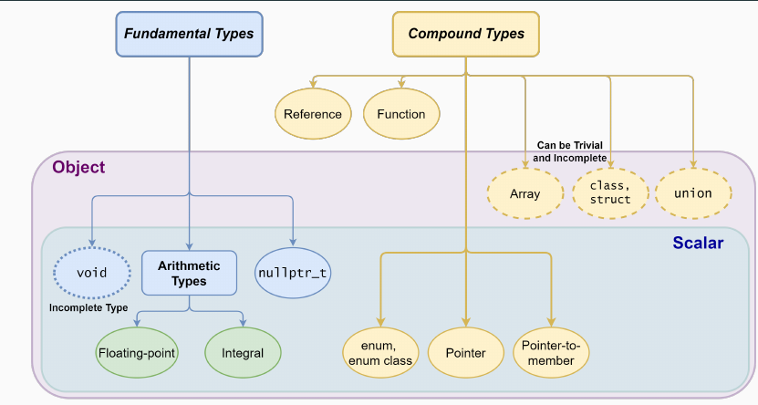

### C

```c
1. ## 运算符
示例：#define EXAMPLE(n) x##n  ->   EXAMPLE(4)  x4
```


### C++对象模型

****

### 被弃用的特性

```C++
不再允许字符串字面值常量赋值给一个 char *。如果需要用字符串字面值常量赋值和初始化一个 char *，应该使用 const char * 或者 auto。

char *str = "hello world!"; // 将出现弃用警告
C++98 异常说明、 unexpected_handler、set_unexpected() 等相关特性被弃用，应该使用 noexcept。

auto_ptr 被弃用，应使用 unique_ptr。

register 关键字被弃用，可以使用但不再具备任何实际含义。

bool 类型的 ++ 操作被弃用。

如果一个类有析构函数，为其生成拷贝构造函数和拷贝赋值运算符的特性被弃用了。

C 语言风格的类型转换被弃用（即在变量前使用 (convert_type)），应该使用 static_cast、reinterpret_cast、const_cast 来进行类型转换。

特别地，在最新的 C++17 标准中弃用了一些可以使用的 C 标准库，例如 <ccomplex>、<cstdalign>、<cstdbool> 与 <ctgmath> 等
    
std::bind 和 std::function、export 被弃用
```


### C++知识点

```
官方文档
https://cplusplus.com/doc/tutorial/exceptions/

https://zh.cppreference.com/w/cpp/thread/unique_lock/unique_lock
```


#### 1.const

```
1. 修饰的变量不能再改变
2. 指向常量的指针(const char *p)  指针常量(char const *p)
3. 常量引用 
4. int getValue() const;  说明该函数不能修改成员变量
5. 修饰类成员变量 只能在初始化列表赋值 (引用类型的成员变量也需要初始化列表赋值)
延伸：
constexpr  常量表达式
```

#### 2.static

```
1.修饰局部变量，修改其存储区域和生存周期
2.修改全局函数，使其只能在此文件中使用
3.静态成员函数、成员变量 
```

#### 3.this

```
1.隐藏于非静态成员函数中 ，指向具体的对象
```

#### 4.用的少的关键字 & 描述符

```
1.
#pragma pack(n) 使用n字节对齐
2. 
decltype()  类型检查
```

#### 右值引用

```
绑定右值(临时对象，将要销毁的对象)的引用。一般表示对象的值
可以实现 传递语义和精确传递
作用 ：
消除两个对象交互时不必要的对象拷贝，节省运算存储资源，提高效率
```

#### 多态  虚函数 注意

```
编译时多态： 函数重载
运行时多态   虚函数：用 virtual 修饰成员函数，使其成为虚函数
！构造函数不能是虚函数 此时还没有虚指针
！虚析构函数
	基类的指针指向派生类对象时，delete时 能调用子类对象析构函数 防止内存泄漏
```

#### 内存管理

```
如何定义一个只能在堆上（栈上）生成对象的类？
堆上： 析构函数私有
栈上： 重载私有化new 和delete
```

分配对象方式

```
1.new操作符 
   调用 operator new 分配内存
   调用 构造函数
2. operator new  只分配内存
	void* a = operator new(32)
3. placement new 在已分配的内存上创建对象。  并且需要手动调用析构函数
	A* p = new (ptr)A
```


#### ！智能指针

```
 #include <memory>

1.shared_ptr  共享对象  计数
2 unique_ptr  独占式
3 weak_ptr   共享但不拥有
4.auto_ptr 弃用
```

#### 强制类型转换

```
1.static_cast
	非多态类型的转换   子类向上转换(隐式) 安全  父类向下转换不安全
2.dynamic_cast
	多态类型的转换   类型检查
3.const_cast
	用于删除 const、volatile特性
4.reinterpret_cast
用于位的解释

```

####  实现通过类名new对象 （反射）

```
一般不同类型的对象 需要用很多if else 来 判断,导致每次有新类型都要该这部分代码。
解决方法:
	用 类名 和 构造类的函数 的映射关系，来替换if else ，每次只需要注册类，new 对象的时候传入类名即可。
	
	参考：https://www.cnblogs.com/onStateChange/p/6590543.html
	https://blog.csdn.net/xiaoqiang321/article/details/128698461
```

#### 泛型模板编程

```
通常会使用.tcc文件来存放模板的实现代码，并在头文件中通过#include指令包含.tcc文件。 参考内存池项目
```


非类型模板参数 ： 使用常量值 用于静态数组的大小、指针、引用等

```c++
#include <iostream>
using namespace std;

template<class T, size_t N> // N 是非类型模板参数
class StaticArray {
public:
	size_t arraysize() { return N; }
private:
	T _array[N]; // 使用非类型模板参数指定静态数组的大小
};

int main() {
    StaticArray<int, 10> a1; // 定义一个大小为10的静态数组
    cout << a1.arraysize() << endl; // 输出 10

    StaticArray<int, 100> a2; // 定义一个大小为100的静态数组
    cout << a2.arraysize() << endl; // 输出 100

    return 0;
}
```

非类型模板参数基于原始数组的使用

```c++
template <class T, size_t N>    
void array_init(T (&parm)[N]){   //这里parm是代表数组的引用   T &parm[n] = array; 
    //...  
} 

//数组的引用
int n3[3] = {2, 4, 6};
int (&rn3)[3] = n3;
```


ObjectFactory.h

```
#ifndef __OBJECTFACTORY_H__
#define __OBJECTFACTORY_H__
 
#include <map>
#include <string>
#include <functional>
 
 //Object为基类， 不同子类继承于基类。
class Object
{
public:
    virtual std::string GetClassName() const = 0;
};
 
class ObjectFactory
{
public:
    static ObjectFactory& GetInstance();
 
    using ObjCreator = std::function<Object*(void)>;
    int RegisterObj(const std::string& className, ObjCreator objCreator);
 
    Object* CreateObj(const std::string& className);
 
private:
    ObjectFactory();
    ~ObjectFactory();
    ObjectFactory(const ObjectFactory&) = delete;
 
    std::map<std::string, ObjCreator> creatorMap_;
};

#define REGISTERCLASS(className) \
class className##Helper { \
public: \
    className##Helper() \
    { \
        ObjectFactory::GetInstance()->RegisterObject(#className, []() \
        { \
            auto* obj = new className(); \
            return obj; \
        }); \
    } \
}; \
className##PanelHelper g_##className##_panelhelper;// 初始化一个helper的全局变量，执行构造函数中的RegisterObject执行。


#endif
```

ObjectFactory.cpp

```
#include "ObjectFactory.h"
using namespace std;
 
ObjectFactory& ObjectFactory::GetInstance()
{
    static ObjectFactory instance_;
    return instance_;
}
 
int ObjectFactory::RegisterObj(const std::string& className, ObjCreator objCreator)
{
    creatorMap_.insert(make_pair(className, objCreator));
    return 0;
}
 
Object* ObjectFactory::CreateObj(const std::string& className)
{
    auto it = creatorMap_.find(className);
    if(it == creatorMap_.end())
    {
        return nullptr;
    }
    return it->second();
}
 
ObjectFactory::ObjectFactory()
{
}
 
ObjectFactory::~ObjectFactory()
{
}
```

测试

```
 REGISTERPANELCLASS(XXX)  //XXX为类名
 auto pObj = (Object*)ObjectFactory::GetInstance()->CreateObject("XXX");
```


### Effective C++

+ 尽量以  const 、 enum 、 inline 替换 define


###　GoogleC++规范


### Modern CPP Programming

#### 一.类型系统

```
C++类型分为 基础类型和混合类型。
基础类型： 
 1. 浮点型 整型
 2. void
 3. nullptr_t
 混合类型:
 1.引用
 2.枚举
 3. class struct union
 ...
 图示如下
```



auto 关键字 可以被编译器翻译 

```
auto a = 1 + 2;  // auto 被推断为int
auto 可以代替复杂的类型声明。
for(auto x : arr)
	...
```

### C++11

+ nullptr关键字 专门用来区分空指针、`0`  替代NULL

```
nullptr关键字
```

+ std::Move()