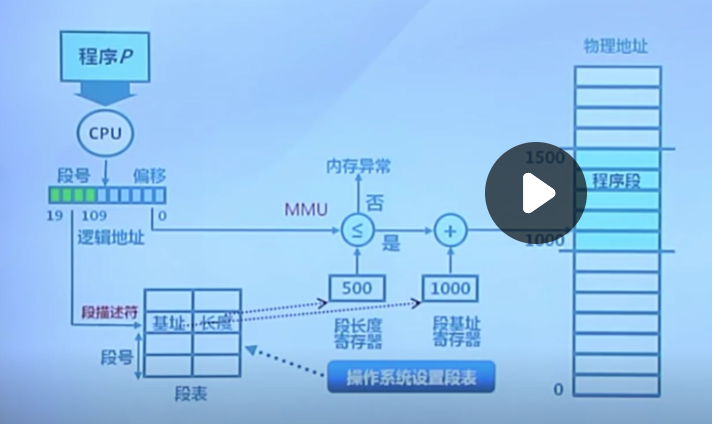
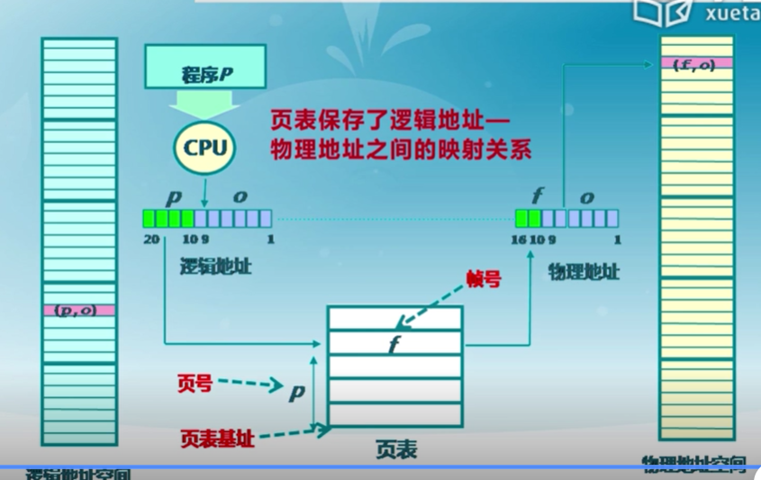
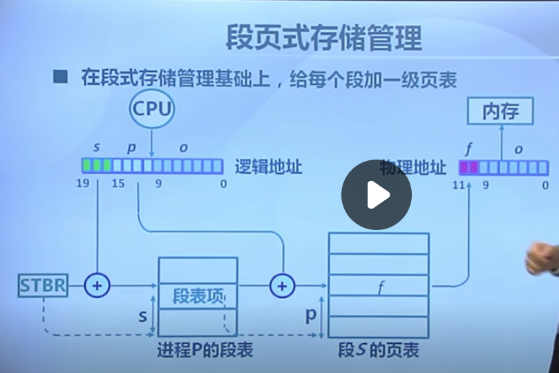

### 参考资料

```
书
2.操作系统 原理与实现
	https://ipads.se.sjtu.edu.cn/ospi/
3.一个操作系统的实现
视频
1.清华 操作系统 
	https://www.xuetangx.com/learn/THU08091000267/THU08091000267/12424484/video/23272428?channel=i.area.learn_title
	指导书 https://objectkuan.gitbooks.io/ucore-docs/content/
	
进度:
实验第四讲搁置 
课程 5.4

汇编：
https://www.zhihu.com/question/23332058/answers/updated
```

### 汇编

```
参考书:汇编语言第4版 
```

#### 1. 基础知识

```
CPU 执行机器指令(00001100...)
汇编指令是机器指令的助记符，不同硬件CPU有不同指令集
汇编指令通过编译器转换为机器指令

CPU从存储器中取信息(指令，数据) ,通过总线通信：
	总线分类：
		1.地址总线  -》    指定访问地址
		2.数据总线   -》   传输数据
		3.控制总线  -》     控制是否读或者写
存储器存储单元为1byte(8bit)
	存储器类别：
		随机存储器(RAM)  丢失
		只读存储器(ROM)  不丢失数据  可以装BIOS，BIOS可以进行基本的输入输出
		

检测点1.1
1.13位宽
8KB = 8 * 1024b = 8192b  log2(8192) = 13 得出位宽为13
2.1024个存储单元  1个存储单元为1b ，则得出 1024/1b = 1024存储单元  编号从 0 -> 1023
3.8192个bit   1024byte
4.1KB = 1024B   1MB = 1024KB   1GB=1024MB
5.2^16 = 65536  2^20 = 1,048,576   2^24 =16,777,216  2^32 = 4,294,967,296
6.1B  1B 2B 2B 4B
7.512次   256次
8.二进制位存放
```


### 笔记

#### 1.启动

```
 概念:
 BIOS : 基本IO处理系统  自检，检测外设 加载bootloader
 bootloader(位于DISK 第一个扇区(512字节))  用来加载os
 OS: 操作系统   
 
 系统启动流程:
 1.CPU初始化  处于实模式
 	CS:IP= 0xf000:fff0   CS:代码段寄存器  IP 指令指针寄存器  
 	自动执行第一条指令    BIOS位于ROM存储器
 2.BIOS初始化  
 	硬件自检	
 	读引导扇区  将bootloader从磁盘的引导扇区加载到0x7c00 然后跳转到 CS:IP =0000:7c00 
 3.加载程序（bootloader） 
 	加载执行内核 跳转到内核执行
 	从硬盘加载操作系统的数据和代码到内存中，并跳转到操作系统起始代码执行
```

#### 2.中断，异常，系统调用

```
操作系统与设备和程序交互： 中断 异常  系统调用
1.为什么需要 这三种机制:
	因为内核不能直接让用户操作，需要某种安全的通信方式来和用户交互。
2.概念
系统调用: 应用程序主动向os发出的服务请求。
异常: 非法指令导致的处理请求。 比如内存错误

中断: 外设、硬件设备的处理请求。
	中断是异步产生的，会随时打断应用程序的执行，且在操作系统的管理之下，应用程序感知不到中断的产生。所以操作系统需要保存被打断的应用程序的执行现场，处理具体的中断，然后恢复被打断的应用程序的执行现场，使得应用程序可以继续执行。 
	
系统调用实现:
	根据系统调用编号 切换到内核态 切换内核堆栈来调用系统调用实现。
	系统调用:INT IRET  堆栈切换 特权级切换
	函数调用:CALL RET  没有堆栈切换
```


#### 3. 连续物理内存分配

```
1.操作系统管理内存方式:
    重定位
    分段
    分页
    虚拟存储

2. 地址空间
    物理地址空间:实际存储在物理内存上
    逻辑地址空间: 程序中的地址
MMU(内存管理单元):把逻辑地址控件转变为物理地址空间

3.地址生成如下图
```


3.4 碎片整理

```
连续物理内存分配：给进程分配一块不小于指定大小的连续的物理内存区域。

调整进程占用的分区位置来减少或避免分区碎片
1.紧凑
	移动分配给进程的内存分区,把占用的空间挪到一起，从而碎片也合到一起，用来合并碎片。
	前提是应用程序可动态重定位。
	注意:此时的操作都是在内存中。
2.分区对换如下图
	等待的进程可以换到外存，从而空出内存空间来执行新的进程。
```


连续分配缺点：
1.分配的物理内存必须连续
2.存在内碎片和外碎片

#### 4.非连续物理内存分配

#####　1.段式存储管理

```
段表示一个连续的内存块 ，若干个段组成进程的逻辑地址空间
比如进程地址空件 = 堆 + 堆栈 + 数据段  + 代码段 

段访问：
```


通过段号在段表获取到基址和长度 从而获取到物理地址   




##### 2.页式存储管理

页帧 把物理地址空间分为大小相同的基本单位。

页面 把逻辑地址空间分为大小相同的基本单位。

页面到页帧的转换通过页表。


页表：  每个进程有一个页表，存储了逻辑地址到物理地址得映射关系。每个页面对应一个页表项  页表地址放在页表基址寄存器(PTBR)

页表项 = 标志位 + 帧号

**页式存储管理得性能问题:**

```
1.访问1个内存单元需要访问两次 (访问页表项 访问数据)
2。页表大小问题 太大了可能导致访问速度慢

如何防止页表访问性能问题： 缓存(快表)   间接访问(多级页表)
```

 


3.段页式存储管理




#### 实验

```
1。关于virtualbox 使用
   右ctrl+alt  	切换鼠标捕获
   右ctrl+F 		退出全屏
   Ctrl+L 不起作用 解决:  set -o emacs
 
  测试实验代码  make qemu
```


判断大小端

```
字节序模式 
小端： 低地址存储低字节
大端： 低地址存储高字节
网络字节序 是大端
#include <iostream>
using namespace std;
int main()
{
	int i = 0x01020304;
	if( *((char*)&i) == 0x01 )
	  cout << "big" << endl;
	else
	  cout << "small" << endl;
	return 0;
}
```
