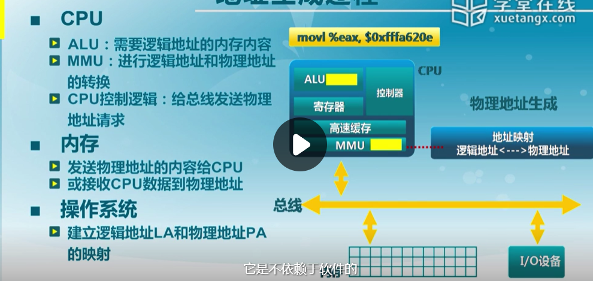
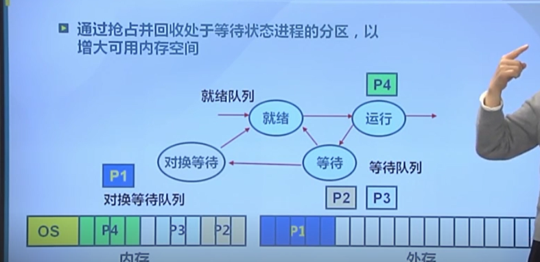
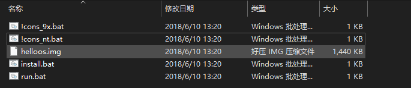

### 参考资料

```
书
1.30天自制操作系统
2.操作系统 原理与实现
	https://ipads.se.sjtu.edu.cn/ospi/
3.一个操作系统的实现
视频
1.清华 操作系统 
	https://www.xuetangx.com/learn/THU08091000267/THU08091000267/12424484/video/23272428?channel=i.area.learn_title
	
进度:
实验第四讲搁置 
课程 5.4

汇编：
https://www.zhihu.com/question/23332058/answers/updated
```

### 笔记

#### 1.启动

```
 概念:
 BIOS : 基本IO处理系统  自检，检测外设 加载bootloader
 bootloader(位于DISK 第一个扇区(512字节))  用来加载os
 OS: 操作系统   
 
 系统启动流程:
 1.CPU初始化  处于实模式
 	CS:IP= 0xf000:fff0   CS:代码段寄存器  IP 指令指针寄存器  
 	自动执行第一条指令    BIOS位于ROM存储器
 2.BIOS初始化  
 	硬件自检	
 	读引导扇区  将bootloader从磁盘的引导扇区加载到0x7c00 然后跳转到 CS:IP =0000:7c00 
 3.加载程序（bootloader） 
 	加载执行内核 跳转到内核执行
 	从硬盘加载操作系统的数据和代码到内存中，并跳转到操作系统起始代码执行
```

#### 2.中断，异常，系统调用

```
操作系统与设备和程序交互： 中断 异常  系统调用
1.为什么需要 这三种机制:
	因为内核不能直接让用户操作，需要某种安全的通信方式来和用户交互。
2.概念
系统调用: 应用程序主动向os发出的服务请求。
异常: 非法指令导致的处理请求。 比如内存错误

中断: 外设、硬件设备的处理请求。
	中断是异步产生的，会随时打断应用程序的执行，且在操作系统的管理之下，应用程序感知不到中断的产生。所以操作系统需要保存被打断的应用程序的执行现场，处理具体的中断，然后恢复被打断的应用程序的执行现场，使得应用程序可以继续执行。 
	
系统调用实现:
	根据系统调用编号 切换到内核态 切换内核堆栈来调用系统调用实现。
	系统调用:INT IRET  堆栈切换 特权级切换
	函数调用:CALL RET  没有堆栈切换
```


#### 3. 连续物理内存分配

```
1.操作系统管理内存方式:
    重定位
    分段
    分页
    虚拟存储

2. 地址空间
    物理地址空间:实际存储在物理内存上
    逻辑地址空间: 程序中的地址
MMU(内存管理单元):把逻辑地址控件转变为物理地址空间

3.地址生成如下图
```




3.4 碎片整理

```
调整进程占用的分区位置来减少或避免分区碎片
1.紧凑
	移动分配给进程的内存分区,把占用的空间挪到一起，从而碎片也合到一起，用来合并碎片。
	前提是应用程序可动态重定位。
	注意:此时的操作都是在内存中。
2.分区对换如下图
	等待的进程可以换到外存，从而空出内存空间来执行新的进程。
```




### 30天自制操作系统 笔记

#### 第1天

```
1 本书用的软盘格式(FAT12) 开发操作系统 运行于模拟器QEMU上
2 启动：软盘第一个扇区(512字节) 称为启动区    计算机读第一个扇区判断是否有启动程序
3 简单的helloworld 
	运行 !cons_nt.bat
	输入	run  成功
```



helloos.img 软盘文件  
run.bat 用模拟器运行的指令


####　第２天

常用汇编指令 和常用寄存器

```
 MOV 赋值  MOV AX,0，相当于 AX=0;
 MOV BYTE [678],123   [] 表示内存地址
 ADD  加法 ADD SI,1  -> SI += 1
 JMP 跳转到指定地址
 
CMP AL, 0  比较 AL == 0
JE fin    条件跳转 上调指令满足条件再跳转

 INT 中断
 
 AX——accumulator，累加寄存器
 CX——counter，计数寄存器
 DX——data，数据寄存器
 BX——base，基址寄存器
 SP——stack pointer，栈指针寄存器
 BP——base pointer，基址指针寄存器
 SI——source index，源变址寄存器
 DI——destination index，目的变址寄存器
 
```


判断大小端

```
字节序模式 
小端： 低地址存储低字节
大端： 低地址存储高字节
网络字节序 是大端
#include <iostream>
using namespace std;
int main()
{
	int i = 0x01020304;
	if( *((char*)&i) == 0x01 )
	  cout << "big" << endl;
	else
	  cout << "small" << endl;
	return 0;
}
```
