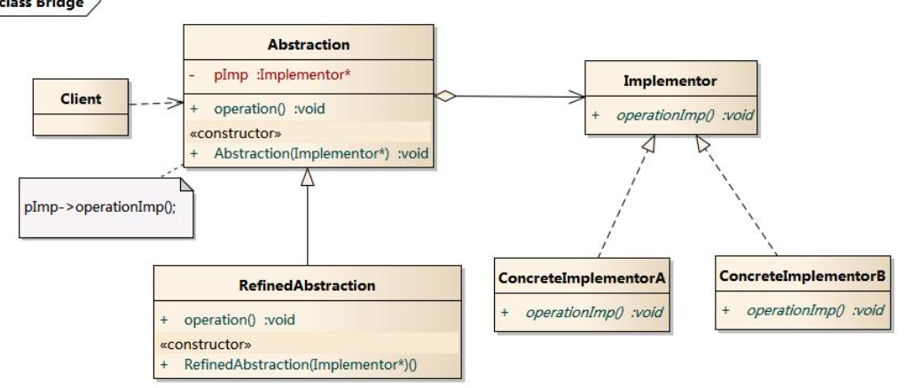
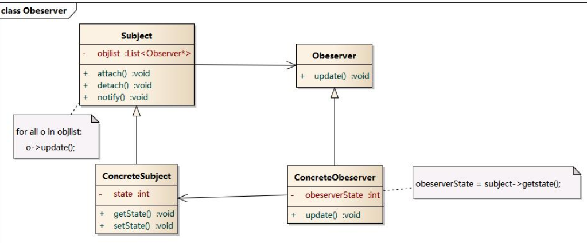
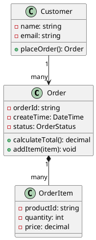
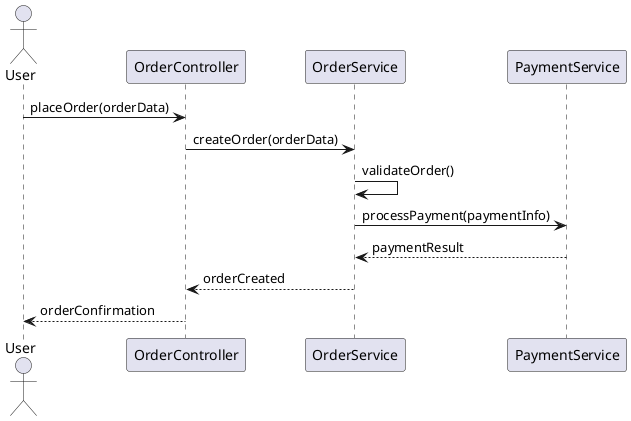

```
参考
https://design-patterns.readthedocs.io/zh-cn/latest/read_uml.html
```


设计思想

```
1. 分解   分而治之 复用性不高
2. 抽象   用通用的方法来实现   复用性高
```

面向对象设计原则

```
1. 依赖倒置原则（DIP）
	高层模块(稳定)不应该依赖于低层模块(变化)，二者都应该依赖于抽象
	抽象(稳定)不应该依赖于实现细节(变化) ，实现细节应该依赖于抽象(稳定)
2.开放封闭原则（OCP）
	对扩展开放，对更改封闭。
3.单一职责原则（SRP）
	• 一个类应该仅有一个引起它变化的原因
4.Liskov 替换原则（LSP）
	• 子类必须能够替换它们
5. 接口隔离原则（ISP）
	• 不应该强迫客户程序依赖它们不用的方法
6.优先使用对象组合，而不是类继承
	• 类继承通常为“白箱复用	对象组合通常为“黑箱复用”。	
7. 针对接口编程，而不是针对实现编程	
```


uml图示例


## 创建型模式

### 单例模式

```
单例类的构造函数为私有；
提供一个自身的静态私有成员变量；
提供一个公有的静态工厂方法。
```

###　工厂模式

１.简单工厂模式

```
简单工厂模式(Simple Factory Pattern)：又称为静态工厂方法(Static Factory Method)模式，它属于类创建型模式。在简单工厂模式中，可以根据参数的不同返回不同类的实例。简单工厂模式专门定义一个类来负责创建其他类的实例，被创建的实例通常都具有共同的父类。
```


2.工厂方法模式


工厂方法模式(Factory Method Pattern)又称为工厂模式，也叫虚拟构造器(Virtual Constructor)模式或者多态工厂(Polymorphic Factory)模式，它属于类创建型模式。在工厂方法模式中，工厂父类负责定义创建产品对象的公共接口，而工厂子类则负责生成具体的产品对象，这样做的目的是将产品类的实例化操作延迟到工厂子类中完成，即通过工厂子类来确定究竟应该实例化哪一个具体产品类。

3.抽象工厂模式
抽象工厂模式(Abstract Factory Pattern)：提供一个创建一系列相关或相互依赖对象的接口，而无须指定它们具体的类。抽象工厂模式又称为Kit模式，属于对象创建型模式。


## 结构型模式

### 适配器模式

```
适配器模式(Adapter Pattern) ：将一个接口转换成客户希望的另一个接口，适配器模式使接口不兼容的那些类可以一起工作，其别名为包装器(Wrapper)。适配器模式既可以作为类结构型模式，也可以作为对象结构型模式。
```


###　桥接模式

```
桥接模式(Bridge Pattern)：将抽象部分与它的实现部分分离，使它们都可以独立地变化
```



## 行为型模式

### 观察者模式

```
建立一种对象与对象之间的依赖关系，一个对象发生改变时将自动通知其他对象，其他对象将相应做出反应。在此，发生改变的对象称为观察目标，而被通知的对象称为观察者，一个观察目标可以对应多个观察者.
观察者模式(Observer Pattern)：定义对象间的一种一对多依赖关系，使得每当一个对象状态发生改变时，其相关依赖对象皆得到通知并被自动更新。观察者模式又叫做发布-订阅（Publish/Subscribe）模式、模型-视图（Model/View）模式、源-监听器（Source/Listener）模式或从属者（Dependents）模式。
```



## ai 说学习路径


### 🎯 核心知识体系

#### 1. **设计模式与原则**（基础）

**必学内容：**

- **SOLID原则**：
  - 单一职责原则（SRP）
  - 开闭原则（OCP）
  - 里氏替换原则（LSP）
  - 接口隔离原则（ISP）
  - 依赖倒置原则（DIP）

- **23种设计模式**：
  ```cpp
  // 重点掌握这些模式：
  // 创建型：工厂、单例、建造者
  // 结构型：适配器、装饰器、外观、代理
  // 行为型：策略、观察者、命令、模板方法
  ```

**推荐学习资源：**

- 书籍：《设计模式：可复用面向对象软件的基础》（GoF）
- 书籍：《Head First设计模式》
- 实践：在项目中刻意应用每种模式

#### 2. **架构模式**（进阶）

**分层架构**：

```cpp
// 理解各层职责和依赖方向
Presentation Layer → Business Layer → Data Access Layer
```

**其他重要模式：**

- 六边形架构（端口与适配器）
- 清洁架构
- 事件驱动架构
- CQRS（命令查询职责分离）
- 微服务架构

**学习资源：**

- 书籍：《企业应用架构模式》
- 书籍：《实现领域驱动设计》
- 在线：Martin Fowler的架构文章

#### 3. **UML与建模**（表达工具）

**必须掌握的图表：**

**类图（Class Diagram）**：


**序列图（Sequence Diagram）**：


**活动图、状态图、组件图**等

**学习资源：**
- 书籍：《UML精粹》
- 工具：PlantUML、Draw.io、StarUML
- 实践：为每个功能模块画图设计

#### 4. **领域驱动设计（DDD）**（复杂业务）

**核心概念：**
```cpp
// 战术设计工具
class DomainModel {
    // 实体（Entity）- 有唯一标识
    class Order { /* 有OrderId */ };
    
    // 值对象（Value Object）- 无标识，不可变
    class Money { 
        double amount;
        string currency;
    };
    
    // 聚合根（Aggregate Root）
    class OrderAggregate {
        Order root;
        vector<OrderItem> items;
    };
    
    // 领域服务（Domain Service）
    class OrderCalculationService();
    
    // 仓储（Repository）
    class IOrderRepository {
        virtual Order findById(OrderId) = 0;
    };
};
```

**战略设计：**
- 限界上下文划分
- 上下文映射图
- 通用语言

**学习资源：**
- 书籍：《领域驱动设计：软件核心复杂性应对之道》
- 实践：从业务专家那里学习领域知识

### 📚 系统化学习路径

#### 第一阶段：基础夯实（1-2个月）

1. **掌握UML**：能熟练绘制类图、序列图
2. **理解SOLID**：能在代码评审中识别违反原则的情况
3. **学习常用模式**：工厂、策略、观察者、装饰器

#### 第二阶段：架构思维（2-3个月）

1. **分层架构实践**：在项目中实施清晰的分层
2. **组件设计**：学习设计可复用的组件
3. **依赖管理**：掌握依赖注入和控制反转

#### 第三阶段：高级主题（3-6个月）

1. **领域驱动设计**：处理复杂业务逻辑
2. **架构决策记录**：学习记录和沟通架构决策
3. **演进式架构**：设计能适应变化的架构

### 🛠️ 实践训练方法

#### 1. **代码重构训练**

```cpp
// 重构前：违反单一职责
class OrderProcessor {
    void process(Order order) {
        validate(order);           // 验证职责
        calculateTotal(order);     // 计算职责  
        saveToDatabase(order);     // 持久化职责
        sendEmail(order);          // 通知职责
    }
};

// 重构后：职责分离
class OrderValidator { /* 只负责验证 */ };
class PriceCalculator { /* 只负责计算 */ };
class OrderRepository { /* 只负责持久化 */ };
class NotificationService { /* 只负责通知 */ };
```

#### 2. **设计模式刻意练习**

每周专注一个设计模式，在项目中寻找应用场景。

#### 3. **架构 Kata 练习**

解决经典的架构问题：
- 电商系统设计
- 博客平台架构
- 实时聊天系统
- 文件处理流水线

#### 4. **代码评审训练**

学习评审他人代码，重点关注：
- 架构一致性
- 设计原则遵守情况
- 可测试性
- 可维护性

### 🔧 工具技能提升

#### 建模工具：

- **PlantUML**：文本化建模，适合版本控制
- **Draw.io**：免费在线工具
- **Visual Paradigm**：专业工具

#### 设计工具：

- **架构决策记录（ADR）模板**
- **C4模型**：Context, Container, Component, Code
- **事件风暴**：领域探索工作坊

### 📖 推荐学习资源

#### 书籍（按顺序阅读）：

1. 《UML精粹》- Martin Fowler
2. 《Head First设计模式》
3. 《代码整洁之道》- Robert C. Martin
4. 《企业应用架构模式》- Martin Fowler
5. 《实现领域驱动设计》- Vaughn Vernon
6. 《架构整洁之道》- Robert C. Martin

#### 在线资源：

- **Martin Fowler的博客**：架构思想的宝库
- **InfoQ架构专栏**：最新架构实践
- **GitHub优秀项目**：学习开源项目的架构设计
- **架构模式目录**：各个架构模式的详细说明

### 🎯 能力评估标准

#### 初级架构师：

- 能画出系统的类图和序列图
- 理解并能应用常见设计模式
- 能在小模块中实施分层架构

#### 中级架构师：

- 能设计中等复杂度系统的整体架构
- 熟练使用DDD战术设计工具
- 能做出技术选型和架构决策

#### 高级架构师：

- 能设计大规模分布式系统架构
- 精通演进式架构和适应性设计
- 能指导团队实施架构最佳实践

### 💡 最重要的建议

1. **理论与实践结合**：学完一个概念立即在项目中实践
2. **从模仿开始**：学习优秀开源项目的架构设计
3. **持续重构**：把架构改进作为持续的过程
4. **业务理解**：最好的架构师首先是业务专家
5. **沟通能力**：架构设计需要团队共识和协作

