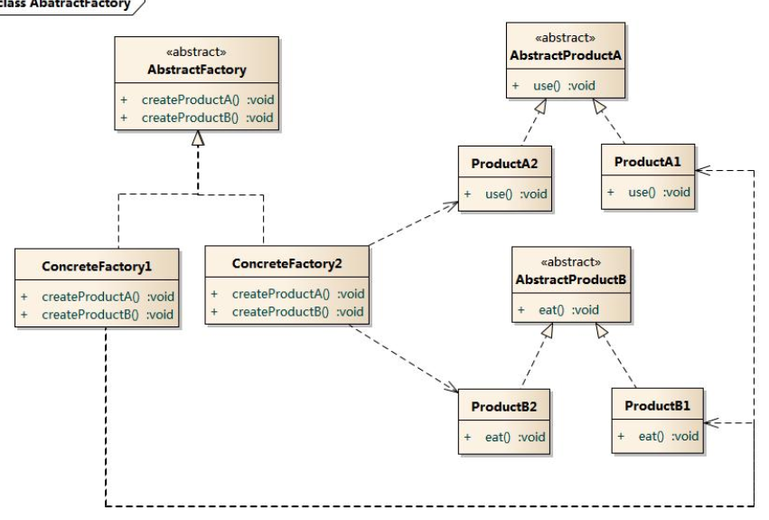

```
参考
https://design-patterns.readthedocs.io/zh-cn/latest/read_uml.html
```


设计思想

```
1. 分解   分而治之 复用性不高
2. 抽象   用通用的方法来实现   复用性高
```

面向对象设计原则

```
1. 依赖倒置原则（DIP）
	高层模块(稳定)不应该依赖于低层模块(变化)，二者都应该依赖于抽象
	抽象(稳定)不应该依赖于实现细节(变化) ，实现细节应该依赖于抽象(稳定)
2.开放封闭原则（OCP）
	对扩展开放，对更改封闭。
3.单一职责原则（SRP）
	• 一个类应该仅有一个引起它变化的原因
4.Liskov 替换原则（LSP）
	• 子类必须能够替换它们
5. 接口隔离原则（ISP）
	• 不应该强迫客户程序依赖它们不用的方法
6.优先使用对象组合，而不是类继承
	• 类继承通常为“白箱复用	对象组合通常为“黑箱复用”。	
7. 针对接口编程，而不是针对实现编程	
```


uml图示例


## 创建型模式

### 单例模式

```
单例类的构造函数为私有；
提供一个自身的静态私有成员变量；
提供一个公有的静态工厂方法。
```

###　工厂模式

１.简单工厂模式

```
简单工厂模式(Simple Factory Pattern)：又称为静态工厂方法(Static Factory Method)模式，它属于类创建型模式。在简单工厂模式中，可以根据参数的不同返回不同类的实例。简单工厂模式专门定义一个类来负责创建其他类的实例，被创建的实例通常都具有共同的父类。
```


2.工厂方法模式


工厂方法模式(Factory Method Pattern)又称为工厂模式，也叫虚拟构造器(Virtual Constructor)模式或者多态工厂(Polymorphic Factory)模式，它属于类创建型模式。在工厂方法模式中，工厂父类负责定义创建产品对象的公共接口，而工厂子类则负责生成具体的产品对象，这样做的目的是将产品类的实例化操作延迟到工厂子类中完成，即通过工厂子类来确定究竟应该实例化哪一个具体产品类。

3.抽象工厂模式
抽象工厂模式(Abstract Factory Pattern)：提供一个创建一系列相关或相互依赖对象的接口，而无须指定它们具体的类。抽象工厂模式又称为Kit模式，属于对象创建型模式。



## 结构型模式

### 适配器模式

```
适配器模式(Adapter Pattern) ：将一个接口转换成客户希望的另一个接口，适配器模式使接口不兼容的那些类可以一起工作，其别名为包装器(Wrapper)。适配器模式既可以作为类结构型模式，也可以作为对象结构型模式。
```

